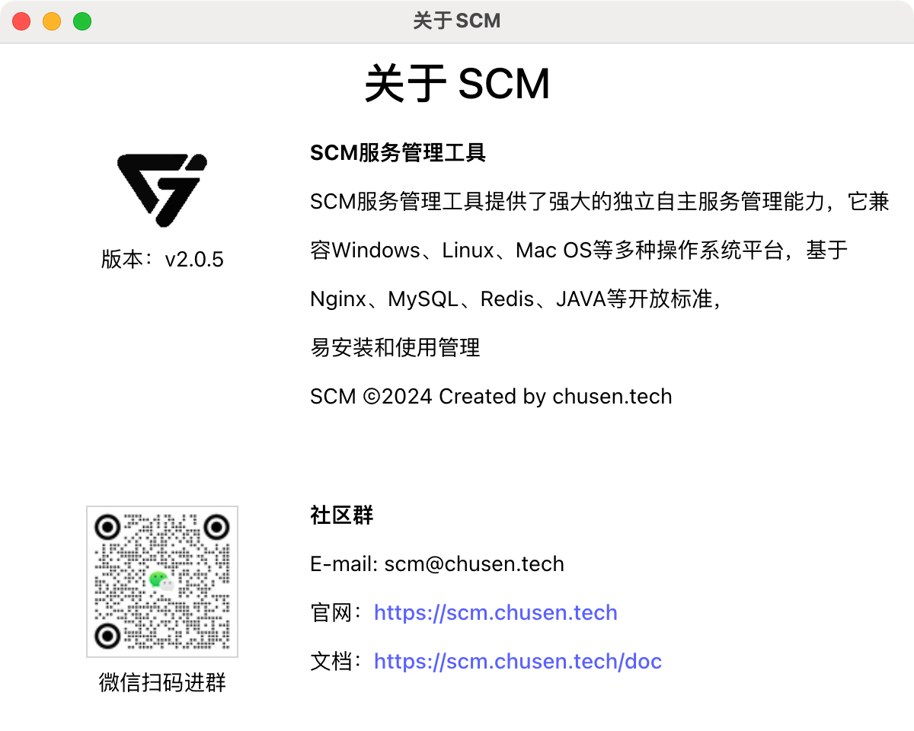

# SCM产品介绍

## 官网地址
https://scm.chusen.tech

支持windows macos linux 
windows版本  https://pan.baidu.com/s/1watzxNlaq75l76Nzin6vhg?pwd=p2pb 
macos版本 https://pan.baidu.com/s/1LS6ulktq0ZsIN1r7gtIVow?pwd=cspg 
linux版本. https://pan.baidu.com/s/1RM5z7cp_awIlHR0udS4Z2A?pwd=nrxn 

## 云服务优惠

## SCM用户群 
微信扫码进群

## 有问题提交到
https://gitee.com/chusenth/scm/issues  

## SCM V2.XX版本

## 功能介绍
1 免费商业版本。相关版权保留。 
2 支持云端下载避免打包太大。 
3 支持自定义服务，提供灵活配置。  
4 支持主题切换，提供多种主题。 
5 支持导入导出服务，提供数据迁移。 
6 支持服务守护，提供后台运行。 
7 支持一键处理。提供快捷操作。 
8 支持内置编辑器，系统自带编辑器。 
9 支持多系统支持，提供多平台支持。  

其他服务功能请自定义配置。

### SCM V2 截图

### V1.XX版本

## 文档
https://scm.chusen.tech/doc/

## 下载版本 
链接: https://pan.baidu.com/s/1RKxpnaZcQ1ferpgDEm9x_g?pwd=4ox1 

## 功能
自定义服务菜单管理功能  
便捷的操作管理方式：开机启动、重启、停止，系统托盘管理  
开机自启动管理功能  
自动升级功能  
人性化提醒及告警动画  
可以根据业务需求灵活修改服务配置，以及日志监控功能  
自定义添加服务软件包  
多平台支持  
支持自定义服务
支持自定义菜单

## 解决了哪些问题
微服务架构项目客户无法自己管理  
客户或企业维护成本高，需要专业技术人员运维  
服务器重启后客户不会操作  
启动/重启/停止无明显消息提醒反馈  
服务过多、启动繁琐  
服务无法集中管理  
无法自动升级  

## 使用对象
适用Spring Boot 微服务架构的个人、团队、企业群体  
适用Spring Cloud 分布式、微服务架构的个人、团队、企业群体  
适用基于若依微服务架构的客户  
适用基于BladeX微服务架构的客户  
适用基于Jeesite微服务架构的客户  
适用基于PigX 快速开发框架的客户  
适用基于若依微服务架构的客户  
适用于期望便捷化的维护与服务支持的客户  

## 优势
支持国产化服务管理功能  
支持多平台操作系统，支持window 、linux、 mac os 等平台  
支持开机自启动管理功能  
支持自动升级功能  
绿色解压版本，操作便捷，为目前微服务、微架构部署提供快速管理各服务的工具  
具有非常强的可扩展性  

## Linxu版本
### scm-dev deb服务列表
scm-dev版本下载地址 https://scm.chusen.tech/ 
支持自定义菜单，自定义脚本 
Nginx  

## Windows版本  
### scm-dev 服务列表
scm-dev版本下载地址 https://scm.chusen.tech/ 
支持自定义菜单，自定义脚本 
Nginx  

### scm-all 服务列表
scm-all版本下载地址 https://scm.chusen.tech/ 
包含全部服务与工具包，方便使用，一键安装 
Nginx  
MySQL 5.7  
Redis   
JDK 1.8  
SpringBoot sys自定义服务   
tomcat8  
Minio  
openssh  
FlashFXP  
FileZillaServer  
屏幕水印 
服务守护 
邮件推送 
钉钉推送 

### scm-jdk 服务列表
scm-jdk版本下载地址 https://scm.chusen.tech/ 
JDK安装下载，scm-jdk 一键安装部署切换主要jdk版本 
JDK8 
JDK11 
JDK17 
JDK21 

### scm-springboot 精简版本服务列表
scm-springboot精简版本版本下载地址 https://scm.chusen.tech/ 
一键安装部署java项目 
Nginx 
MySQL 5.7 
Redis 
JDK8 
SpringBoot 

### scm-springboot 服务列表
scm-springboot版本下载地址 https://scm.chusen.tech/ 
一键安装部署java项目 
Nginx 
MySQL 5.7 
Redis 
JDK8 
SpringBoot 
服务守护 
屏幕水印 
邮件推送 
钉钉推送 

### scm-tomcat 服务列表
scm-tomcat版本下载地址 https://scm.chusen.tech/ 
scm-tomcat 一键安装部署java项目 
Nginx 
MySQL 
Redis 
JDK 
tomcat 
服务守护 
屏幕水印 
邮件推送 
钉钉推送 

## SCM 截图

 

## SCM 官网
https://scm.chusen.tech/

## 版权声明

版权归属chusen.tech所有，并保留一切权利。非雏森科技书面同意，任何单位及个人不得擅自摘录本手册部分或全部内容。

## 免责声明

由于产品版本升级或其他原因，本手册内容会不定期进行更新。除非另有约定，本手册仅做使用指导，本手册所有陈述、信息和建议不构成任何明示或暗示的担保。
如使用者更新替换相关服务导致相关法律版权纠纷等问题雏森科技不承担任何责任。

其他作者fork后的版本，由其他作者负责，与本作者无关。
复制本项目后，由其他作者负责，与本作者无关。
本项目非盈利目的，如有侵权请联系作者删除。